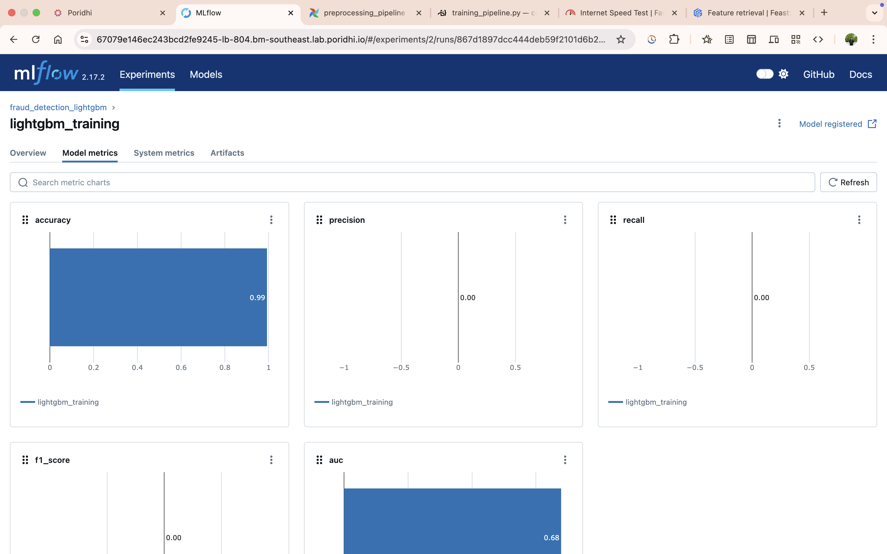

# End to End Machine Learning Model Pipeline 

## Overview

This Machine Learning model pipeline does following:
- Data Ingestion from MongoDB and builds a Feature Engineering Pipeline using Apache Airflow.
- The Pipeline stores featured data into Feast which is running with Online store of Redis and Offline store as local files.
- The Training Pipeline ingest featured data to train Machine Learning models (XGBoost, LGBM, Isolation Forest) and pick the best model to serve.
- Also stores the artifacts on MLFlow.


## Project Setup

Clone the git repository
```
git clone https://github.com/nakibworkspace/Fraud-detection-pipeline.git
```
Setup the VSCode
```sudo apt update && sudo apt upgrade -y
sudo apt install python3 python3-venv python3-pip mongodb redis-server
```

Create a Virtual Environment
```python3 -m venv airflow_env
source airflow_env/bin/activate
```

Install Airflow
```
AIRFLOW_VERSION=2.7.3
PYTHON_VERSION="$(python3 --version | cut -d " " -f 2 | cut -d "." -f 1-2)"
CONSTRAINT_URL="https://raw.githubusercontent.com/apache/airflow/constraints-${AIRFLOW_VERSION}/constraints-${PYTHON_VERSION}.txt"
pip install "apache-airflow==${AIRFLOW_VERSION}" --constraint "${CONSTRAINT_URL}"
```
Install the dependencies
``` 
pip install -r requirements.txt
```

Initialize Airflow db
```
export AIRFLOW_HOME=~/airflow
airflow db init
```

Create Airflow user
```
airflow users create \
  --username admin \
  --firstname admin \
  --lastname admin \
  --role Admin \
  --email admin@admin.com \
  --password admin

```

Start Airflow UI
```
airflow webserver --port 8081 (Terminal 1)
airflow scheduler (Terminal 2)
```

Access the Airflow UI using Load Balancer
IP:
```
ip addr show eth0
```
and port 8081


Start Mongodb and Redis
```
sudo systemctl start mongodb
sudo systemctl start redis
```

Verify Redis running
```
redis-cli ping
```
will deliver PONG


Upload Dataset to Mongodb
Run
scripts/upload_to_mongodb.py

Check mongodb 
```
sudo systemctl status mongodb
```
will show Active

Connect to Mongodb Shell
```
mongo
>
show fraud_detection
```

Setup Feast
```
feast init fraud_feature_repo
cd fraud_feature_repo
```
Then
```
cd fraud_detection_features
feast apply
```

This will generate a registry.db in data directory.

Go to Airflow UI and trigger preprocessing pipeline

Start MLFlow server

Run the mlflow_start.py file on root directory 
```
python mlflow_start.py
```

Access the MLFlow UI using Load Balancer on 5000 port


Outputs on Airflow UI:

**Preprocessing Pipeline**

Pushed to feast successfully

Shows the execution time of the whole process


.png)
Total Pipeline

**Training Pipeline**


Outputs on MLFlow registry:

MLFlow UI


XGBoost performance and artifacts


LGBM performance and artifacts




### Note:
The files \
**debug_data_quality.py** - to debug data quality issues in your training pipeline by comparing source data with Feast feature data and testing the training logic.\

**inspect_fraud_features.py** - The script inspects the fraud_features feature view in the Feast feature store and tests its compatibility with the training pipeline. \

**new.py** - to check datatypes of featured data, 
troubleshoot.py - The script diagnoses and fixes issues with the Feast feature store setup. It checks the directory structure, initializes the store, verifies feature definitions, validates the data source (data_source.parquet), and tests feature retrieval.\

**setup_feast.py** - The script sets up a simplified Feast feature store by checking the data source (data_source.parquet), applying feature definitions with feast apply, initializing the store, and testing feature serving with a sample entity dataframe.
